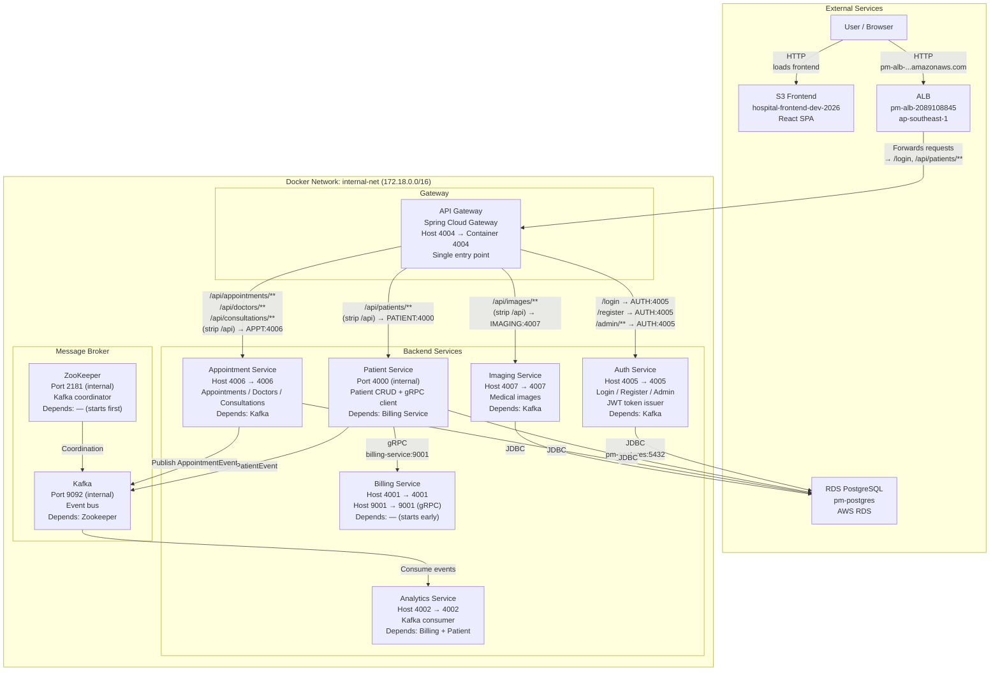

```mermaid
graph TB
    subgraph EXTERNAL["External Services"]
        USER["User / Browser"]
        S3_FE["S3 Frontend<br/>hospital-frontend-dev-2026<br/>React SPA"]
        ALB["ALB<br/>pm-alb-2089108845<br/>ap-southeast-1"]
        RDS["RDS PostgreSQL<br/>pm-postgres<br/>AWS RDS"]
    end

    subgraph INTERNAL_NET["Docker Network: internal-net (172.18.0.0/16)"]
        subgraph GATEWAY["Gateway"]
            GW["API Gateway<br/>Spring Cloud Gateway<br/>Host 4004 → Container 4004<br/>Single entry point"]
        end

        subgraph KAFKA_LAYER["Message Broker"]
            ZK["ZooKeeper<br/>Port 2181 (internal)<br/>Kafka coordinator<br/>Depends: — (starts first)"]
            KAFKA["Kafka<br/>Port 9092 (internal)<br/>Event bus<br/>Depends: Zookeeper"]
        end

        subgraph SERVICES["Backend Services"]
            AUTH["Auth Service<br/>Host 4005 → 4005<br/>Login / Register / Admin<br/>JWT token issuer<br/>Depends: Kafka"]
            PATIENT["Patient Service<br/>Port 4000 (internal)<br/>Patient CRUD + gRPC client<br/>Depends: Billing Service"]
            BILLING["Billing Service<br/>Host 4001 → 4001<br/>Host 9001 → 9001 (gRPC)<br/>Depends: — (starts early)"]
            APPT["Appointment Service<br/>Host 4006 → 4006<br/>Appointments / Doctors / Consultations<br/>Depends: Kafka"]
            IMAGING["Imaging Service<br/>Host 4007 → 4007<br/>Medical images<br/>Depends: Kafka"]
            ANALYTICS["Analytics Service<br/>Host 4002 → 4002<br/>Kafka consumer<br/>Depends: Billing + Patient"]
        end
    end

    USER -->|"HTTP<br/>loads frontend"| S3_FE
    USER -->|"HTTP<br/>pm-alb-...amazonaws.com"| ALB
    ALB -->|"Forwards requests<br/>→ /login, /api/patients/**"| GW

    GW -->|"/login → AUTH:4005<br/>/register → AUTH:4005<br/>/admin/** → AUTH:4005"| AUTH
    GW -->|"/api/patients/**<br/>(strip /api) → PATIENT:4000"| PATIENT
    GW -->|"/api/appointments/**<br/>/api/doctors/**<br/>/api/consultations/**<br/>(strip /api) → APPT:4006"| APPT
    GW -->|"/api/images/**<br/>(strip /api) → IMAGING:4007"| IMAGING

    PATIENT -->|"gRPC<br/>billing-service:9001"| BILLING
    PATIENT -->|"Publish PatientEvent"| KAFKA
    APPT -->|"Publish AppointmentEvent"| KAFKA
    KAFKA -->|"Consume events"| ANALYTICS
    ZK -->|"Coordination"| KAFKA

    AUTH -->|"JDBC<br/>pm-postgres:5432"| RDS
    PATIENT -->|"JDBC"| RDS
    APPT -->|"JDBC"| RDS
    IMAGING -->|"JDBC"| RDS
```
